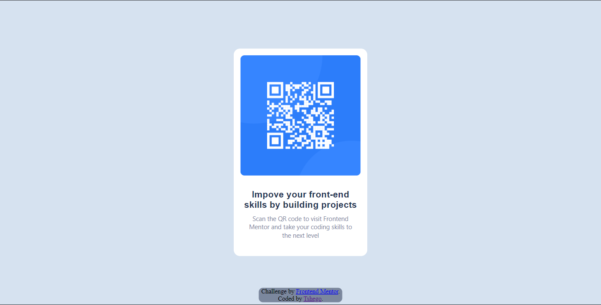

# Frontend Mentor - QR code component solution

This is a solution to the [QR code component challenge on Frontend Mentor](https://www.frontendmentor.io/challenges/qr-code-component-iux_sIO_H). Frontend Mentor challenges help you improve your coding skills by building realistic projects. 

## Table of contents

- [Overview](#overview)
  - [Screenshot](#screenshot)
- [My process](#my-process)
  - [Built with](#built-with)
  - [What I learned](#what-i-learned)
  - [Useful resources](#useful-resources)
- [Author](#author)

**Note: Delete this note and update the table of contents based on what sections you keep.**

## Overview

### Screenshot

#### Desktop Preview

#### Smaller screen Preview

### Links

- Live Site URL: [Add live site URL here](https://your-live-site-url.com)

## My process

### Built with

- Semantic HTML5 markup
- CSS custom properties
- Flexbox

### What I learned

This challange really solidified my HTML and CSS basics

### Useful resources

- [w3Schools - html](https://www.w3schools.com/html/) - HTML Basics.
- [w3Schools - css](https://www.w3schools.com/css/) - CSS Basics

## Author

- Frontend Mentor - [@tshegofatso-motlhakane](https://www.frontendmentor.io/profile/tshegofatso-motlhakane)
- LinkedIn - [@TshegofatsoMotlhakane](https://www.linkedin.com/in/tshegofatso-motlhakane-905600233/)

